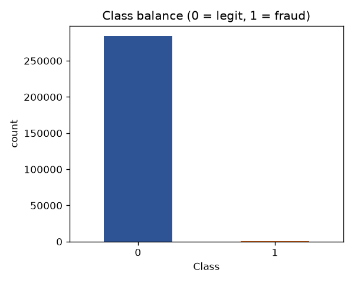
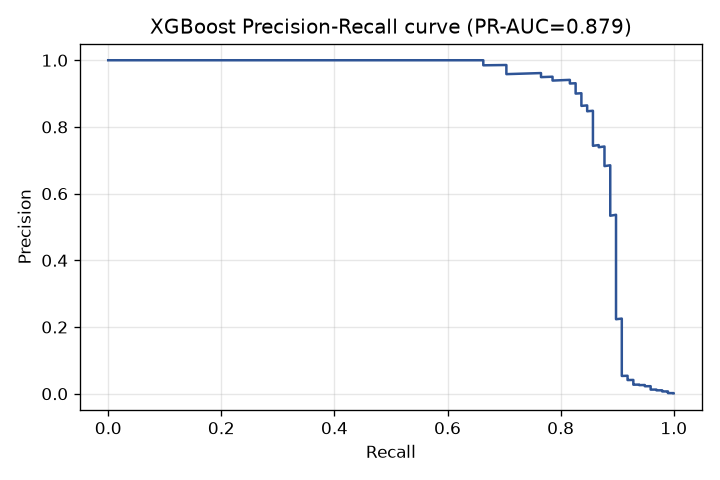
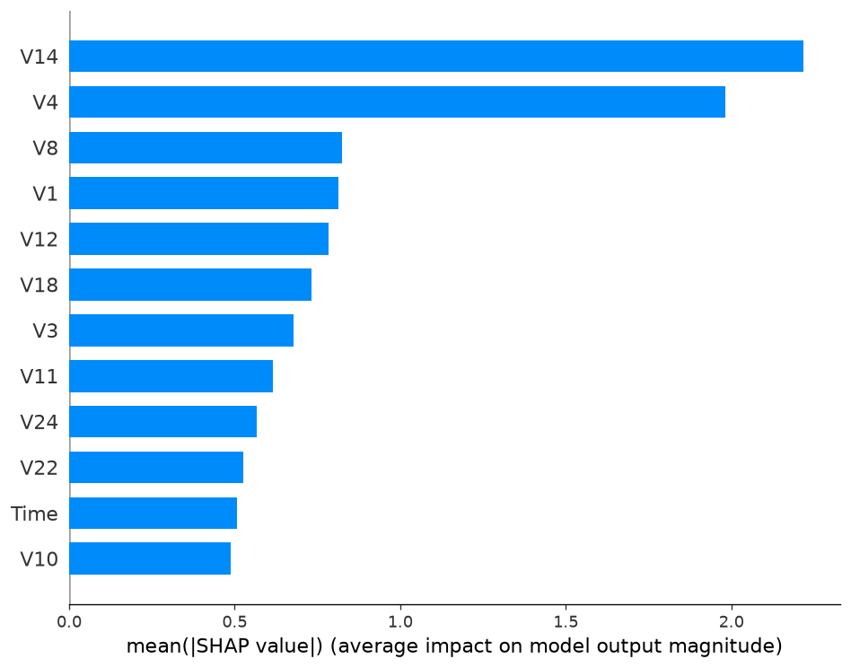

# Real-Time Transaction Fraud Detection API

An explainable machine-learning service that scores a card / e-wallet transaction for fraud in real time and returns human-readable **reason codes**. Built to mirror the flagship ML problem at Malaysian banks and e-wallets (Maybank, CIMB, GXBank, Touch 'n Go, BigPay), where a model must not only flag fraud but justify *why* for compliance.

**Live demo:** `<add your Hugging Face Space URL here>`
**Interactive API docs:** `<your-space-url>/docs`

---

## Problem

Fraud is extremely rare — in this dataset, **0.173%** of transactions. A model that predicts "not fraud" every time is 99.83% accurate and catches nothing. The real challenge is catching fraud (recall) without drowning the operations team in false alarms (precision), and being able to explain each decision.

## Dataset

The [Credit Card Fraud Detection](https://www.kaggle.com/datasets/mlg-ulb/creditcardfraud) dataset — 284,807 European card transactions with 492 frauds (0.173%). Features `V1`–`V28` are PCA-anonymized for privacy (as real banks do), plus `Time`, `Amount`, and the `Class` label. The write-up is framed around a Malaysian e-wallet fraud-scoring scenario.

## Approach

1. **EDA** — quantified the 0.173% imbalance and found signal in `Amount` (fraud has a lower median but higher mean — classic card-testing behavior) and in features `V14`, `V17`, `V12`.
2. **Preprocessing** — stratified 80/20 split (preserving the fraud ratio), `RobustScaler` on `Amount` and `Time` fitted on the training set only (no leakage).
3. **Imbalance handling** — **SMOTE** synthetic oversampling applied to the training set only.
4. **Models** — a dummy and a logistic-regression baseline to beat, then an **XGBoost** classifier.
5. **Explainability** — **SHAP** (TreeExplainer) for global feature importance and per-transaction reason codes.
6. **Serving** — a **FastAPI** endpoint, containerized with **Docker**, deployed on Hugging Face Spaces.

## Results

Evaluated on the untouched, realistically-imbalanced test set (56,962 transactions, 98 frauds):

| Model | PR-AUC | ROC-AUC |
|---|---|---|
| Logistic Regression (balanced) | 0.7175 | 0.9720 |
| **XGBoost + SMOTE** | **0.8786** | **0.9823** |

**PR-AUC** (average precision) is the headline metric because it is the honest measure for rare-event problems — far more meaningful than accuracy here.

XGBoost confusion matrix at the default 0.5 threshold:

|  | Predicted legit | Predicted fraud |
|---|---|---|
| **Actual legit** | 56,839 | 25 |
| **Actual fraud** | 14 | 84 |

### Threshold choice

The model outputs a probability, not a hard label. Raising the decision threshold trades recall for precision:

| Threshold | Precision | Recall |
|---|---|---|
| 0.40 | 0.72 | 0.88 |
| 0.50 | 0.77 | 0.86 |
| **0.90 (deployed)** | **0.93** | **0.83** |

The API ships with a **0.90** threshold (best F1, precision-friendly — minimizes false alarms). In production this is a business lever: lower it toward 0.40 if catching more fraud outweighs the cost of extra verification calls.

## Explainability

SHAP confirms the model relies on the same features EDA flagged — `V14` dominates, followed by `V4`, `V12`, `V10` — evidence it learned real patterns, not noise. Every `/score` response includes the top-5 reason codes so an analyst (or regulator) can see *why* a transaction was flagged.





## API usage

`POST /score` with a transaction's features returns:

```json
{
  "fraud_probability": 0.9998,
  "threshold": 0.9,
  "decision": "FRAUD",
  "reason_codes": [
    {"feature": "V14", "value": -6.174, "impact": 6.619, "pushes": "fraud"},
    {"feature": "V17", "value": -6.537, "impact": 1.474, "pushes": "fraud"}
  ]
}
```

## Run locally

```bash
python -m venv venv
venv\Scripts\Activate.ps1              # Windows PowerShell
pip install -r requirements.txt

# 1. Put creditcard.csv in data/ (download from Kaggle link above)
# 2. Build the model
python src/preprocess.py
python src/train.py
python src/evaluate.py

# 3. Serve the API
uvicorn src.api:app --reload
# open http://127.0.0.1:8000/docs
```

## Tech stack

Python · pandas · scikit-learn · XGBoost · imbalanced-learn (SMOTE) · SHAP · FastAPI · Uvicorn · Docker

## Project structure

```
fraud-detection-api/
├── data/                  # raw dataset (gitignored)
├── models/                # trained model, scaler, threshold
├── reports/figures/       # EDA, PR curve, SHAP charts
├── src/
│   ├── explore.py         # EDA
│   ├── preprocess.py      # split + scaling
│   ├── train.py           # dummy, logreg, XGBoost+SMOTE
│   ├── evaluate.py        # PR-AUC, threshold sweep
│   ├── explain.py         # SHAP
│   └── api.py             # FastAPI service
├── Dockerfile
├── requirements.txt
└── requirements-api.txt   # slim runtime deps for the container
```

## Notes & next steps

- The V-features are pre-anonymized; a production system would receive raw `Amount`/`Time` and derive the rest from an upstream feature pipeline.
- Next: add unit tests (pytest), model monitoring for drift, and a CI/CD pipeline (this becomes Project 6 in my portfolio roadmap).
